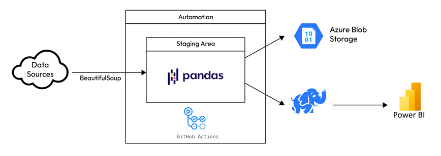

This project was taken from the book "Cracking the Data Engineering Interview"
Page 32 - 44

This is the data pipeline highlevel architecture

This project was taken from the book "Cracking the Data Engineering Interview"
Page 32

Go to websites and look at the data to be extracted. Determine which tool you’ll use to get 
the data.

Build your web scraping script to get and transform this data.

Provision a Blob storage container on Azure and upload your extracted data as a Parquet file.

Provision a PostgreSQL database on Azure and upload your extracted data to it.

Automate this process and schedule it with GitHub Actions to run every Saturday and Sunday 
until the end of the season.

Connect a Power BI service to your PostgreSQL database and do some Exploratory Data 
Analysis (EDA).

Source data URLs:
League table: https://www.bbc.com/sport/football/premier-league/table

Top scorers: https://www.bbc.com/sport/football/premier-league/top-scorers

In the book there are few more data sources, but for my project, I will use above two to make it simple

Now we will scrape data from two web URLs

We’ll build our scraper with Python functions in a file called scrape.py. This way, we can 
call and run the function from another script just by importing it. But first, let’s look at some 
basic code we can use to scrape table content from most static sites using Beautiful Soup with 
little to no cleaning:

# connect to Azure SQL database via VScode using SQL server extemsion
Install "SQL Server (mssql)" extenstion
Profile Name : any name you like : I have put "sport-analytics"
Connection Group : Default
Input Type: Parameters
Server name: sport-analytics-server.database.windows.net ( this is from Azure server overview)
Port: 1433 (default)
Trust server certificate - unticked
Authentication type: SQL Login
User name: Sulara
Password: slr@8315
You can now test connection
or click on Database name: to see the database you have created in Azure sql server
Then click "Connect" 

# Connect with Azure SQL DB and push data as tables

Challenge faced:

Your code isn't the problem. The Azure SQL server's firewall is blocking your computer's IP address. I reproduced it with a read-only connection test (no tables written):

Cannot open server 'sport-analytics-server' requested by the login.
Client with IP address '202.180.76.121' is not allowed to access the server. (40615)
Your .env values load correctly and ODBC Driver 17 is installed. The connection reaches Azure, and Azure rejects it before the login is checked. Azure SQL blocks every IP by default until you add a firewall rule for it.

To fix it (Azure Portal):

Open your SQL server sport-analytics-server, not the database.
Go to Security → Networking.
Under Public network access, choose Selected networks if it isn't already set.
Under Firewall rules, click + Add your client IPv4 address (it should fill in 202.180.76.121), then click Save.
Wait 1–5 minutes, then run your script again.
Your home IP will probably change from time to time, since most home internet IPs aren't fixed. When this error comes back with a different IP, add the new one the same way.

A smaller, separate issue: the output also shows Invalid connection string attribute. That's most likely the "Connection Timeout": "30" entry in push_to_azure_sql.py:53. That keyword comes from ADO.NET, and the ODBC driver doesn't recognise it, so it's just ignored. You can delete that line; it isn't what's stopping the connection.

If you get a different error after adding the firewall rule, paste it here.

After fixing Firewall issue, there was another one

The data functions all work fine, so the error is likely in df.to_sql — the pandas str dtype suggests pandas 3.x, which may conflict with the pinned sqlalchemy==2.0.20. I'll verify the versions and test to_sql against a throwaway in-memory SQLite database.

Found it: pandas 3.0.6 can't recognize the SQLAlchemy 2.0.20 engine, causing that AttributeError. I'll verify a newer SQLAlchemy version resolves it before making any changes to your project.

The firewall fix worked; the new error comes from a package version mismatch, not the database.

The cause: your project has pandas 3.0.6 but pins sqlalchemy==2.0.20 in pyproject.toml. pandas 3 doesn't recognise engines from a SQLAlchemy that old. It treats yours as a raw database connection, so df.to_sql(...) fails with:

# Challenge faced when running github actions

The log shows the cause. Python, the packages and the Blob upload all worked. The run fails at the first Azure SQL connection with Login timeout expired (HYT00), which means the runner couldn't reach the SQL server or finish logging in before the driver gave up (about 15 seconds by default).

That also means my earlier guess about uv run --no-project was wrong. The packages were found, so that line wasn't the problem.

Likely causes, most likely first:

The database is serverless and was auto-paused. A paused serverless Azure SQL database takes 30–60 seconds to wake up, so the first login times out. The next run then often succeeds. To check, open the database in the Azure Portal and look at Overview → Compute tier. If it says "Serverless" and the status is "Paused", this is the cause. You can fix it with a longer timeout plus a retry (code below), or by turning auto-pause off. With a run every 15 minutes, the database may rarely pause anyway, depending on your auto-pause delay.
Public network access is turned off or limited. Go to the SQL server → Networking. If public access is "Disabled", or set to "Selected networks" with only a private endpoint, GitHub runners can't get through, and you get a timeout rather than an error message. Enable public access with a firewall rule. A blocked IP usually gives a clear "Client with IP address … is not allowed" error instead of a timeout, so the firewall alone is less likely.
The server name is incomplete. The AZURE_SQL_SERVER secret needs the full name, yourserver.database.windows.net, not just yourserver.

Code fix (in push_to_azure_sql.py or wherever you create the engine). This waits up to 60 seconds for each login and tries 3 times:

I made a change to 
"Connection Timeout": "60"
in push_to_azure_sql.py

and also on the Azure SQL Database "sport_analytics_db" - I have turned off the "Auto-pause delay" 